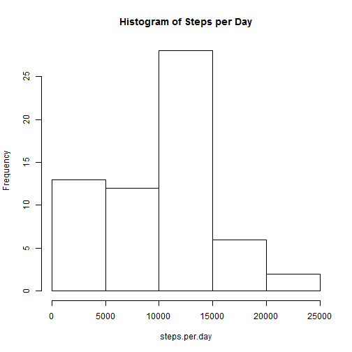
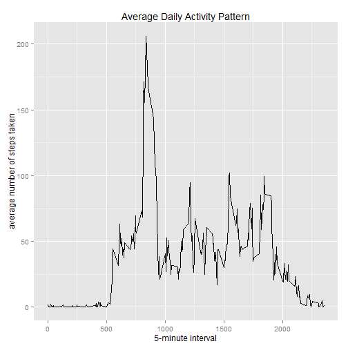
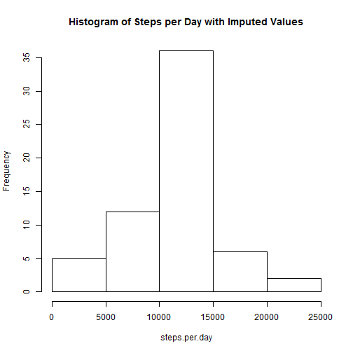
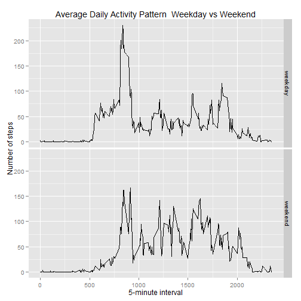

Reproducible Research - Peer Assessment 1
========================================================
 

## Load and Preprocess the Data


```r
data <- read.csv("activity.csv",stringsAsFactors=FALSE)
```


## What is mean total number of steps taken per day?

```r
steps.per.day <- tapply(data$steps, data$date, FUN=sum, na.rm=TRUE)
mean.steps.per.day = mean(steps.per.day, na.rm=TRUE)
median.steps.per.day = median(steps.per.day, na.rm=TRUE)
hist(steps.per.day,main="Histogram of Steps per Day")
```

 
    
The mean number of steps per day is 9354.2295082  
The median number of steps per day is 10395  


## What is the average daily activity pattern?


```r
library(ggplot2)
avg.per.int <- aggregate(data$steps, by=list(data$interval),
                      FUN=mean, na.rm=TRUE)
colnames(avg.per.int)<-c("interval","avg.steps")
max.steps.per.int<-avg.per.int[avg.per.int$avg.steps == max(avg.per.int$avg.steps),]
ggplot(avg.per.int, aes(x=interval, y=avg.steps)) +
    geom_line() +
    xlab("5-minute interval") +
    ylab("average number of steps taken") +
    ggtitle("Average Daily Activity Pattern")
```

 
    
     
The 5 minute interval across all days which on average contains the maximum number
  of steps is835    
The number of steps taken on average during this interval 
  was  206.1698113
   


## Imputing missing values  
The strategy used for imputing missing values is to take the mean for the 5 minute
interval


```r
NA.count<-sum(is.na(data))
imp.data<-data
for (i in 1:nrow(imp.data)) {
    if (is.na(imp.data$steps[i])) {
        imp.data$steps[i] <- avg.per.int[which(imp.data$interval[i] == avg.per.int$interval), ]$avg.steps
    }
}

steps.per.day <- tapply(imp.data$steps, imp.data$date, FUN=sum, na.rm=TRUE)
imp.mean.steps.per.day = mean(steps.per.day, na.rm=TRUE)
imp.median.steps.per.day = median(steps.per.day, na.rm=TRUE)
mean.change = ((imp.mean.steps.per.day - mean.steps.per.day)/mean.steps.per.day)*100
median.change = ((imp.median.steps.per.day - median.steps.per.day)/median.steps.per.day)*100
hist(steps.per.day,main="Histogram of Steps per Day with Imputed Values")
```

 
    
The mean number of steps per day with imputed values is 1.0766189 &times; 10<sup>4</sup>  
The median number of steps per day with imputed values is 1.0766189 &times; 10<sup>4</sup>   
The mean value has increased by 15.0943396 percent after imputation was performed  
The median value has increased by 3.5708387 percent after imputation was performed


## Are there differences in activity patterns between weekdays and weekends?


```r
weekday<-c("Monday","Tuesday","Wednesday","Thursday","Friday")
imp.data$day.type <- ifelse(weekdays(as.Date(imp.data$date)) %in% weekday,"weekday", "weekend")
imp.data$day.type<-as.factor(imp.data$day.type)

avg.per.int.daytype <- aggregate(imp.data$steps, by=list(imp.data$interval,imp.data$day.type),
                      FUN=mean, na.rm=TRUE)
colnames(avg.per.int.daytype)<-c("interval","day.type","avg.steps")
ggplot(avg.per.int.daytype, aes(interval, avg.steps)) + geom_line() + facet_grid(day.type ~ .) +
    xlab("5-minute interval") + ylab("Number of steps") + 
    ggtitle("Average Daily Activity Pattern  Weekday vs Weekend")
```

 


